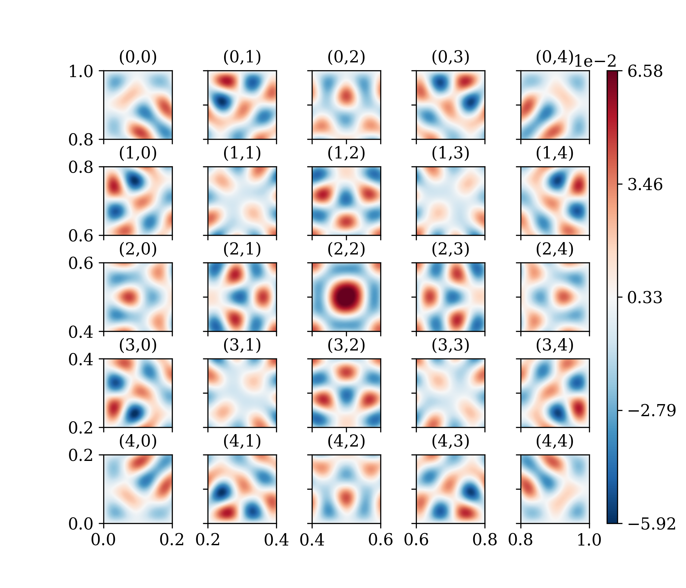

##  Non-overlapping, Schwarz-type Domain Decomposition Method for Physics and Equality Constrained Artificial Neural Networks (PECANNs)

**We have substantially advanced our original PECANN method. Please see our latest work:** [PECANN-CAPU](https://github.com/HiPerSimLab/PECANN-CAPU)



##  [Download publication](https://doi.org/10.1016/j.cma.2024.117706)

### Summary:  
We introduce a non-overlapping, Schwarz-type domain decomposition method employing a generalized interface condition, tailored for physics-informed machine learning of partial differential equations (PDEs) in both forward and inverse scenarios. Our method utilizes physics and equality constrained
artificial neural networks (PECANN) in each subdomain. Diverging from the
original [PECANN](https://doi.org/10.1016/j.jcp.2022.111301) method, which uses initial and boundary conditions to constrain
the PDEs alone, our method jointly employs both the boundary conditions and
PDEs to constrain a specially formulated generalized interface loss function
for each subdomain. This modification enhances the learning of
subdomain-specific interface parameters, while delaying information exchange
between neighboring subdomains, and thereby significantly reduces communication
overhead. By utilizing an augmented Lagrangian method with a conditionally
adaptive update strategy, the constrained optimization problem in each
subdomain is transformed into a dual unconstrained problem. This approach
enables neural network training without the need for ad-hoc tuning of model
parameters. We demonstrate the generalization ability and robust parallel
performance of our method across a range of forward and inverse problems, with
solid parallel scaling performance up to 32 processes using the Message Passing
Interface model. A key strength of our approach is its capability to solve both
Laplace's and Helmholtz equations with multi-scale solutions within a unified
framework, highlighting its broad applicability and efficiency.

## Citation
Please cite us if you find our work useful for your research:
```
@article{pecann_ddm_2025,
title = {Non-overlapping, {Schwarz}-type domain decomposition method for physics and equality constrained artificial neural networks},
journal = {Computer Methods in Applied Mechanics and Engineering},
volume = {436},
pages = {117706},
year = {2025},
issn = {0045-7825},
doi = {10.1016/j.cma.2024.117706},
author = {Qifeng Hu and Shamsulhaq Basir and Inanc Senocak},
}
```
### Funding Acknowledgment
This material is based upon work supported by the National Science Foundation under Grant No. 1953204 and in part by the University of Pittsburgh [Center for Research Computing​ and Data](https://crc.pitt.edu/), RRID:SCR_022735, through the resources provided. Specifically, this work used the H2P cluster, which is supported by NSF award number OAC-2117681.
### Questions and feedback?
For questions or feedback feel free to reach us at [Qifeng Hu](qih56@pitt.edu), [Inanc Senocak](senocak@pitt.edu),
